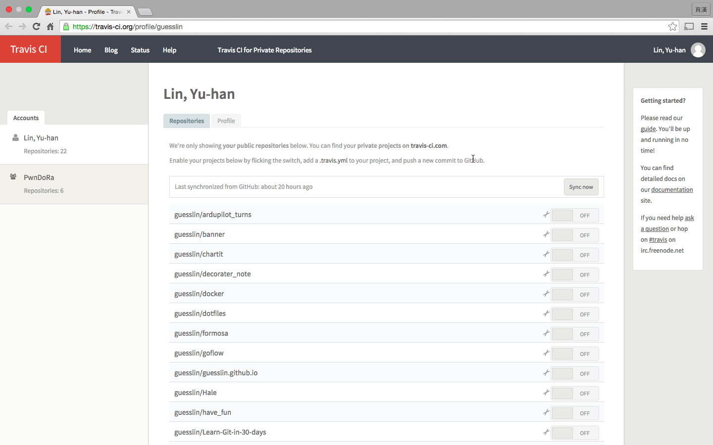
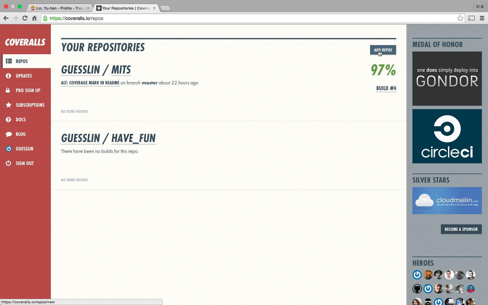
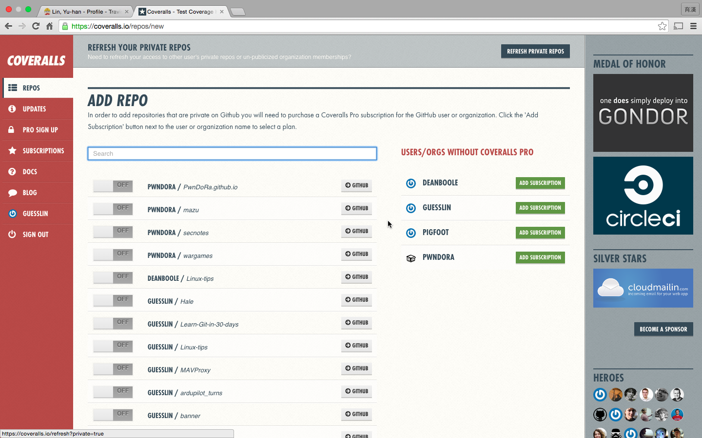

Golang package write-up
=======================

前言
---
總是要寫點memo才能記得住自己做過些什麼，不然一直重複做一樣的事情是進步不了的。最近在努力的累積自己的作品，把以前論文用到的交互資訊斷詞（Mutual Information Text Segmanetation）工具或者是跟執行者合作所寫的各式各樣的小專案，把這些東西寫完之後總是需要些維護，為了不讓自己每寫一個專案就查一次資料，所以寫了一個這樣的文件來節省自己的時間，若是讀者你們對於接下來的內容有興趣或者是發現需要改正的地方，還請大方的讓筆者我知道。

github.com
----------
眾所皆知的git倉儲平台。[github.com][]

[github.com]: https://github.com/

Travis-Ci
---------
可以幫助自己測試/安裝寫好的程式，當然測試單元還是要自己寫，主要目的在於幫忙檢查套件是否能正確安裝。

首先需要先建立Travis-Ci的帳號，到[Travis-Ci][]使用github帳號登入，接著在登入畫面選擇需要使用Travis-Ci的github專案，若是沒有看到專案可以點選右上角的`Sync now`按鈕，如下圖所示：



在[Travis-Ci][]上選擇好專案後，接著在專案內設定所需要Travis-Ci進行測試的腳本：

1. 在專案目錄底下加入 `.travis.yml` 
2. 選擇語言
3. 選擇測試版本號
4. 設定需要安裝的額外套件 
5. 執行測試的腳本

完整的`.travis.yml`如下所示：

```
language: go
go:
 - 1.2
 - 1.3
 - release
 - tip

script:
 - go test -v ./...
```
[Travis-Ci]: https://travis-ci.org/


coveralls
---------
協助統計測試覆蓋率的平台

首先到[Coveralls][]網站使用github帳號登入，接著在入口畫面右上角選擇`Add repos`，如下圖所示：



接著選擇需要使用[Coveralls][]服務的github專案



在[Coveralls][]選擇完專案之後，需要針對專案的`.travis.yml`做些許修改，加上使用[Coveralls][]的設定。

1. 在`install`時安裝檢查測試覆蓋率的套件`gocov`以及將結果送至[Coveralls][]的`goveralls`
2. 在成功執行之後使用`goveralls`檢查測試覆蓋率

修改後完整的`.travis.yml`檔案內容如下：

```
language: go
go:
 - 1.2
 - 1.3
 - release
 - tip

install:
 - go get github.com/axw/gocov/gocov
 - go get github.com/mattn/goveralls
 - if ! go get code.google.com/p/go.tools/cmd/cover; then go get golang.org/x/tools/cmd/cover; fi

script:
 - go test -v ./...
 - $HOME/gopath/bin/goveralls -service=travis-ci
```

腳本新增的部分主要是為了檢查專案測試的覆蓋率並將計算結果傳至[Coveralls][]

[Coveralls]: https://coveralls.io/
